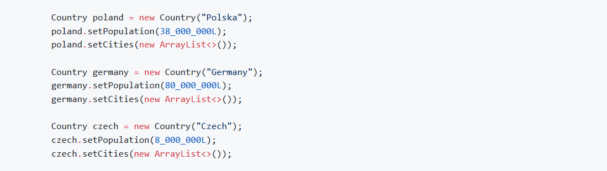
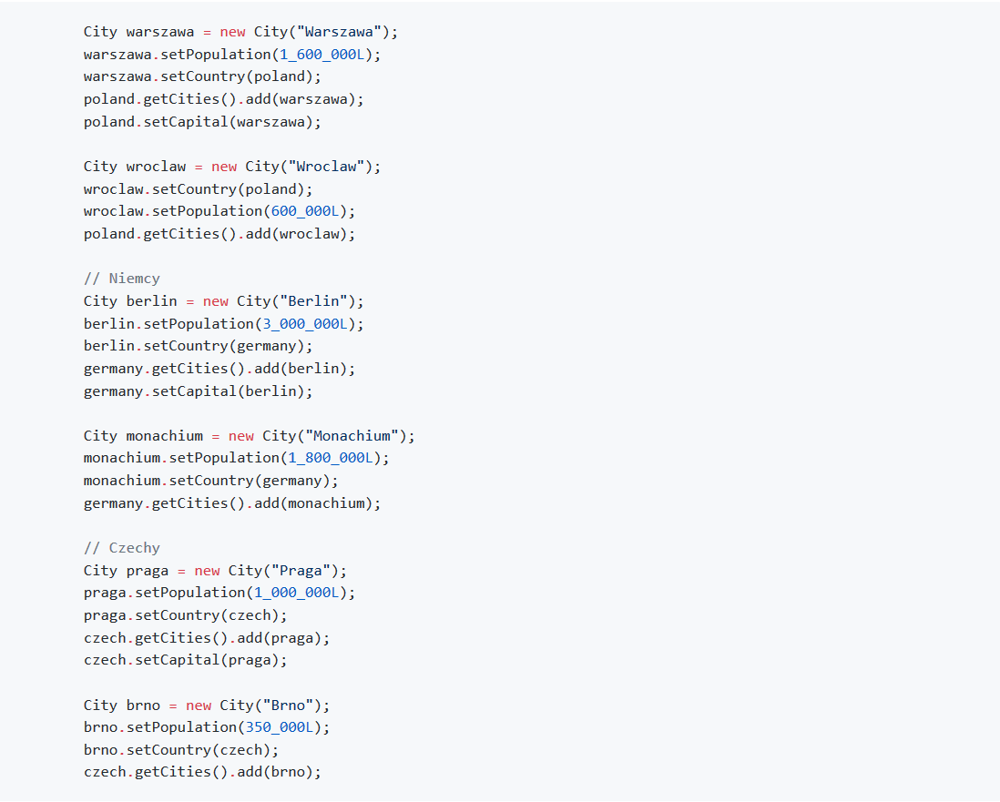
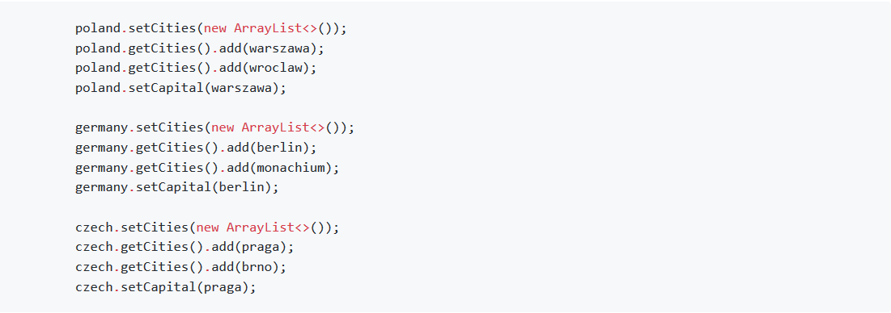

Tworzenie obiektów Państw w kodzie klasy `BuilderApp`. Wykorzystujemy tylko dostarczone konstruktory oraz metody typu `set`/`get`. Cały kod powinien znaleźć się w metodzie `main`.

1. Zaczynamy od utworzenia obiektów Państw:

2. Teraz tworzymy po dwa miasta dla każdego z Państw:

3. Na koniec miasta dodajemy do listy miast w Państwach i ustawiamy stolice

