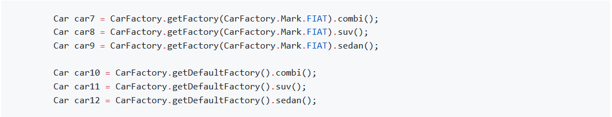

Chociaż nasz kod tworzenia obiektów nieco się wydłużył, to stał się niezależny od tworzenia obiektu konkretnej fabryki. Moglibyśmy wykorzystać nawet metodę `getDefaultFactory` i nawet nie wiedzieć kto jest dostawcą samochodów.

Pamiętaj, że do użycia metody `getDefaultFactory` potrzebujesz uruchomić aplikację z parametrem maszyny wirtualnej `-Ddefault.car.made=FIAT` albo `-Ddefault.car.made=SKODA`.