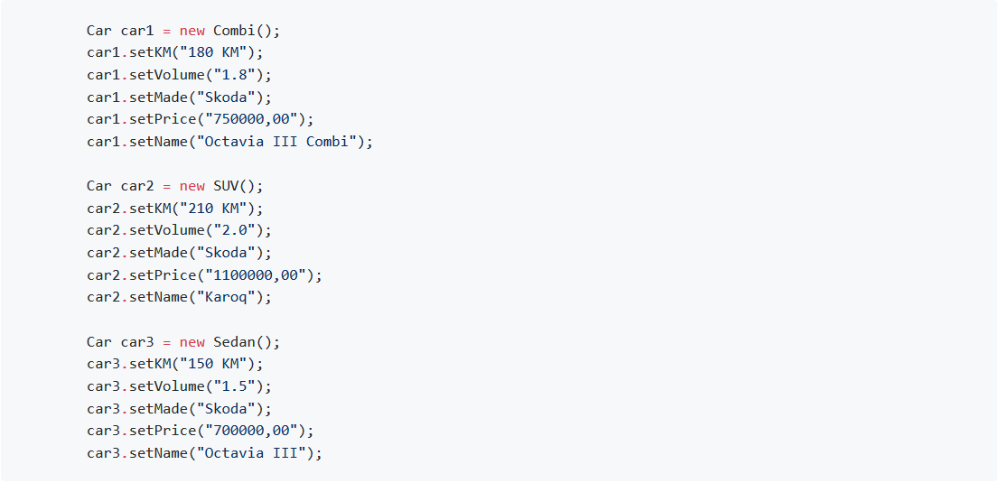
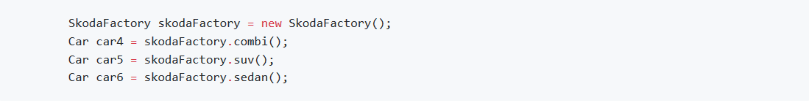
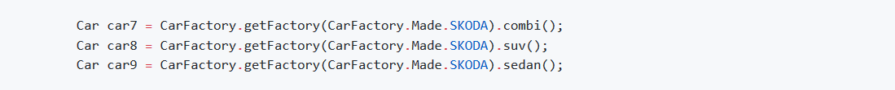
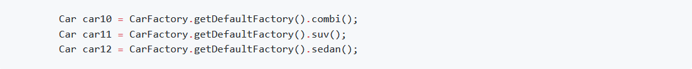

Zmiana producenta aut w pierwszej części wymusza na nas ręczną zmianę tworzenia obiektów:

---

Druga część, to podmiana tworzenia fabryki i dostosowanie nazewnictwa zmiennych, aby odpowiadały producentowi:

---

Przy użyciu wzorca fabryki abstrakcyjnej zmieniamy tylko wartość enum'a, którego używamy do uzyskania fabryki:

---

W wersji z konfiguracją domyślną kod pozostaje bez zmian:

