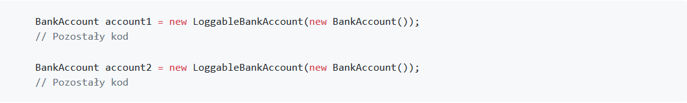
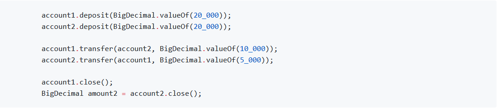

Wprowadzenie wzorca dekorator jest banalnie proste i pojawia się w miejscu tworzenia obiektów:

---

Jednoczenie z kodu metody `main` możemy usunąć `System.out.println`. Nie potrzebujemy już ręcznie wywoływać zapisu na konsoli, bo dzieje się to automatycznie. Wystarczyło utworzyć odpowiedni typ konta:

