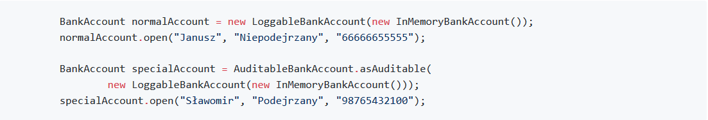
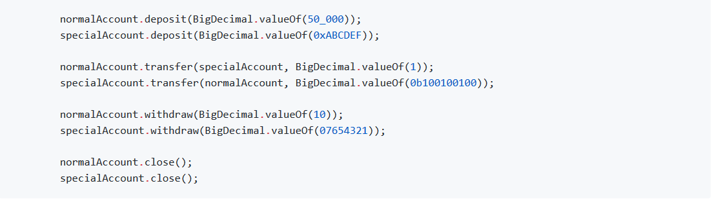
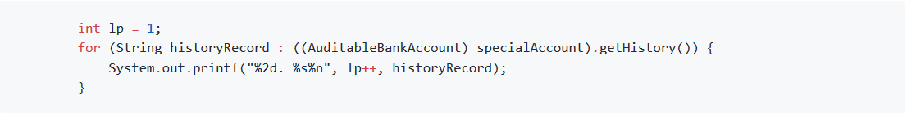

Historię konta wprowadzamy poprzez poniższe uzupełnienie klasy `AuditableBankAccount`. Historię przechowujemy prosto, jako listę operacji typu `String`. Wybór listy zachowuje nam chronologię odczytu elementów, zgodną z ich dodawaniem. Samą listę zwracamy korzystając z metody `Collections.unmodifiableList`, która tworzy nam kopie naszej listy unieumożliwiającą wprowadzanie zmian w strukturze kopii ani w strukturze oryginalnej listy.

---

Nowe konta tworzymy z użyciem klas dekoratorów. W przypadku klasy `AuditableBankAccount` stosujemy metodę fabrykującą.

---

Wykonujemy operacje, a na koniec możemy wyświetlić historię konta audytowanego

