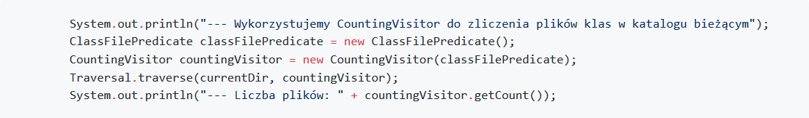
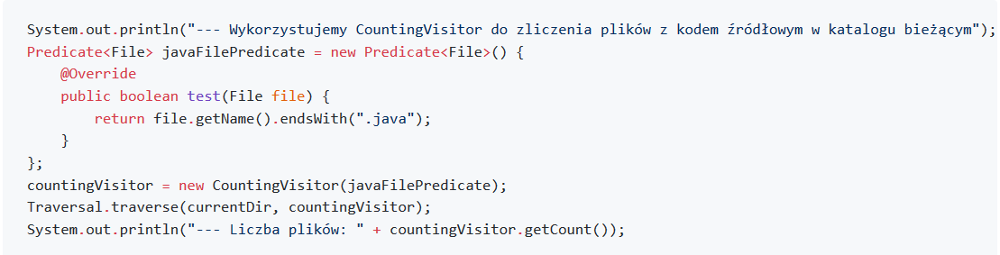
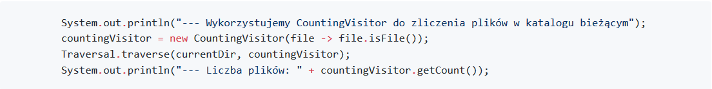
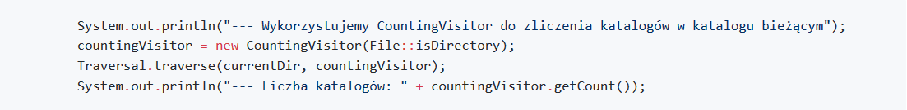

W pierwszej kolejności zliczymy wszystkie pliki klass bazując na klasie `CountingVisitor` oraz klasie `ClassFilePredicate`:

---

Teraz stworzymy lokalną klasę anonimową, aby dostarczyć bezpośrednio w metodzię implementację nowego predykatu. Dzięki temu nie musimy niepotrzebne mnożyć klas. W końcu chodzi nam raptem o implementację jednej prostej metody. Jednej linijki kodu!

---

Poprzedni krok uchronił nas przed tworzeniem nowej klasy predykatu, ale wciąż sporo trzeba zrobić aby dostarczyć prostą linijkę `return file.getName().endsWith(".java");`. Spróbujmy zatem skorzystać z wyrażeń lambda:

---

Jest pięknie! Ale gdybyśmy nasze wyrażenie lambda (i implementację klasy `Predicate`) mieli oprzeć na wywołaniu pojedynczej metody, to da się jeszcze krócej:

